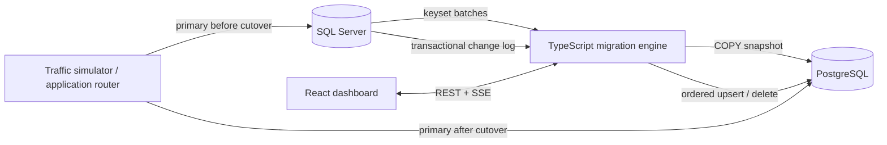

# ZeroShift

ZeroShift is a runnable near-zero-downtime SQL Server → PostgreSQL migration lab. It is not a simulated UI: batches are read from SQL Server with keyset pagination, committed through PostgreSQL `COPY`, and reflected in the dashboard from persistent checkpoints. Concurrent writes are captured transactionally, replayed in order, validated, and drained during a controlled cutover.

> **Lab change capture:** ZeroShift deliberately uses an **Educational Transactional Change Log**, not native SQL Server CDC. Triggers append row images inside the source transaction. This runs consistently with the local container and makes ordering visible. `change_id`, not a timestamp, defines total order.

## Quick start

Requirements: Docker Desktop with at least 6 GB available (SQL Server is the largest container).

```bash
cp .env.example .env
docker compose up --build
```

Open [http://localhost:5173](http://localhost:5173). Generate the small dataset, start traffic, then start the migration. For a clean slate use `make reset`.

## Architecture



The five-table domain is `customers → orders → order_items/products` plus `payments`. The migration follows that dependency order.

## Why the snapshot boundary is safe

Triggers are installed before any lab activity and every source mutation writes its change event in the same transaction. Starting a run first reads the maximum committed `change_id` as boundary **B**, then copies current table rows, then replays events with `change_id > B`.

- A transaction committed before B is visible to the later copy.
- A transaction open while B is read receives an ID only when it commits, after B, so it replays.
- An update after B that the copy already sees is harmless because replay is an idempotent upsert.
- A delete after B either removes a copied row or is a harmless no-op.

This avoids the dangerous “copy now, enable capture later” gap. SQL Server `DATETIME2` timestamps are not used for ordering because transactions can share timestamps and commit order may differ from wall-clock observation.

## The migration path

1. **COPY:** Tables are read with `WHERE id > @last ORDER BY id`, never `OFFSET`. Each bounded batch streams as CSV into PostgreSQL `COPY`.
2. **CAPTURE:** transactional triggers retain INSERT, UPDATE, and DELETE row events while copying continues.
3. **CATCH-UP:** ordered events become idempotent `INSERT … ON CONFLICT DO UPDATE` or `DELETE`. `applied_changes` makes replay restart-safe.
4. **VALIDATE:** source/target counts, min/max IDs, normalized sample hashes, and relationships are compared.
5. **CUTOVER:** writes freeze, the final log drains, validation and sequence sync run again, and the application router switches to PostgreSQL.

Rows and their checkpoint update share one PostgreSQL transaction. If `COPY` or the checkpoint fails, both roll back. Resume starts at the last committed ID; repeating an uncommitted batch is safe because it never became visible.

Secondary indexes are built after the bulk copy. Identity sequences are advanced beyond each migrated maximum and `ANALYZE` refreshes planner statistics. Essential primary/foreign keys remain present so the lab exposes dependency errors instead of hiding them.

## Type mappings

| SQL Server         | PostgreSQL               | Policy                             |
| ------------------ | ------------------------ | ---------------------------------- |
| `UNIQUEIDENTIFIER` | `UUID`                   | Preserve canonical value           |
| `BIT`              | `BOOLEAN`                | Explicit true/false                |
| `NVARCHAR(n/MAX)`  | `VARCHAR/TEXT`           | UTF-8, Arabic preserved            |
| `DATETIME2(3)`     | `TIMESTAMPTZ`            | Treat source values as UTC         |
| `DECIMAL(19,4)`    | `NUMERIC(19,4)`          | Exact string/driver representation |
| `BIGINT IDENTITY`  | identity-backed `BIGINT` | Sync after copy and final drain    |

## Data, CLI, and safety controls

```bash
npm run seed:small       # 1k customers / 5k orders
npm run seed:medium      # 20k / 100k
npm run seed:large       # 100k / 500k (+ related rows)
npm run lab:status
npm run migrate:start
npm run migrate:resume
npm run validate
npm run cutover
```

Host CLI commands require local Node plus reachable databases; inside Compose use `docker compose exec backend node dist/cli.js status`.

The Failure Lab can stop the worker, fail the next batch, pause CDC, or add delay. “Slow demo” is explicitly artificial; real-speed mode adds no batch delay. Maximum concurrency is intentionally one copy worker and one ordered replay loop to protect a production-like source.

## Rollback is not a button

Before target-only writes, returning to SQL Server is straightforward. After PostgreSQL accepts writes, changing a connection string back would lose them. The lab counts PostgreSQL-only mutations and reports the rollback as unsafe. A real rollback then needs reverse replication or a reconciliation window; ZeroShift models this truth rather than pretending to implement it.

## Demo scenarios

- **Basic:** generate → migrate → validate → cut over.
- **Live production:** start traffic first; watch the source and CDC backlog change during copy.
- **Crash recovery:** choose Slow demo, crash during a table, inspect the last checkpoint, resume.
- **Validation failure:** finish, corrupt one target customer, rerun validation; counts match but the checksum fails.
- **Unsafe rollback:** cut over, resume traffic, then inspect the Cutover page’s PostgreSQL-only write count.

## Development and verification

```bash
npm install
npm run typecheck
npm test
npm run build
docker compose build
```

Integration tests use real databases when `RUN_INTEGRATION=1`; they are skipped otherwise. `make test` runs the fast unit suite. Set the database host/port environment variables and run `RUN_INTEGRATION=1 npm test` for the real-database suite.

## Troubleshooting

- SQL Server can take 30–90 seconds on first boot. `docker compose ps` should show both databases healthy.
- On Apple Silicon the SQL Server service uses `linux/amd64`; emulation is slower.
- If ports 1433, 5432, 3000, or 5173 are occupied, change the host side in Compose.
- `make reset` deletes named database volumes. This destructive action is appropriate only for the local lab.
- Inspect `docker compose logs backend sqlserver postgres` when health checks fail.

See [interview notes](docs/interview-notes.md) and the concise [architecture decisions](docs/adr/).
